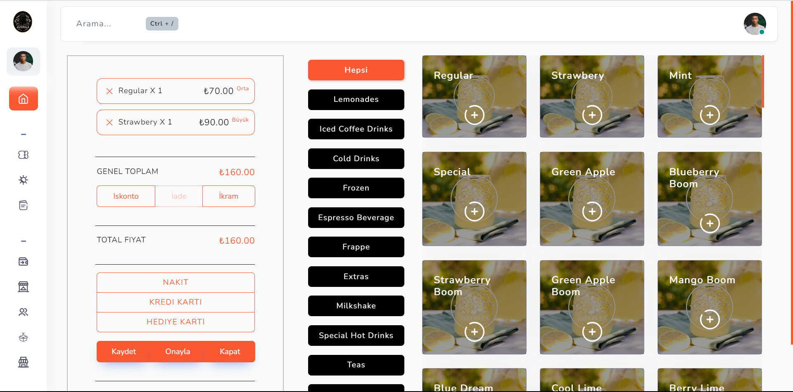
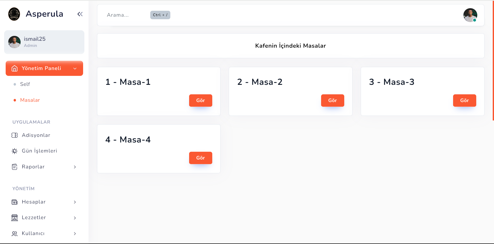

<h1 style="color:#3498db;">☕ Asperula Cafe Sipariş Sistemi</h1>

<strong style="color:#e74c3c;">Proje:</strong> Asperula Cafe Web Tabanlı Sipariş Sistemi

<strong style="color:#e74c3c;">Geliştirici:</strong> Buğra Batuhan Başar

<strong style="color:#e74c3c;">Kod Paylaşımı:</strong> Bu proje müşteri için özel olarak geliştirilmiştir ve kodlar paylaşılmamaktadır.

<h2 style="color:#2ecc71;">Proje Özeti</h2>

Asperula Cafe için geliştirdiğim bu web tabanlı sipariş sistemi, cafe işletmesinin operasyonlarını etkili bir şekilde yönetmek ve optimize etmek amacıyla kapsamlı bir çözüm sunmaktadır. Proje, kullanıcılara ve yöneticilere dinamik ve kullanıcı dostu bir yönetim paneli ile desteklenen birçok özelliği sunar.

<h2 style="color:#2ecc71;">Öne Çıkan Özellikler</h2>
<ul>
    <li><strong style="color:#f39c12;">Ödeme Şekilleri Yönetimi:</strong> Ödeme yöntemleri dinamik olarak eklenebilir, düzenlenebilir ve kaldırılabilir. Çeşitli ödeme seçenekleri sistemde kolayca yapılandırılabilir.</li>
    <li><strong style="color:#f39c12;">Müşteri Bilgileri Yönetimi:</strong> Müşteri bilgileri, sipariş geçmişleri ve iletişim bilgileri dinamik olarak eklenebilir ve düzenlenebilir.</li>
    <li><strong style="color:#f39c12;">Çoklu İşletme Yönetimi:</strong> Asperula Cafe'nin birden fazla şubesini ekleyebilir ve dinamik olarak yönetebilirsiniz. Her şubenin bağımsız olarak yönetilmesi mümkün olmaktadır.</li>
    <li><strong style="color:#f39c12;">Depo ve Stok Yönetimi:</strong> Depolar ve stok hareketleri dinamik olarak izlenebilir ve yönetilebilir. Stok seviyeleri, ürün hareketleri ve depo bilgileri detaylı bir şekilde kontrol edilebilir.</li>
    <li><strong style="color:#f39c12;">Çalışan Yönetimi:</strong> Sipariş sistemini kullanabilecek tüm çalışanların bilgileri dinamik olarak yönetilebilir. Çalışan profilleri ve yetkilendirme ayarları yapılandırılabilir.</li>
    <li><strong style="color:#f39c12;">Ürün ve Kategori Yönetimi:</strong> Ürünler ve kategoriler dinamik olarak eklenebilir, düzenlenebilir ve silinebilir. Ürün bilgilerinin yönetimi ve kategorilendirilmesi kolaylıkla yapılabilir.</li>
    <li><strong style="color:#f39c12;">İşlem Logları:</strong> Sistem üzerinde gerçekleştirilen tüm işlemler detaylı olarak kaydedilir. İşlem logları, sistem yönetimi ve denetimi için kullanılır.</li>
    <li><strong style="color:#f39c12;">Gelir ve Gider Yönetimi:</strong> Yönetim kadrosu, gelir ve gider bilgilerini detaylı bir şekilde görüntüleyebilir. Gelir ve gider raporları oluşturulabilir.</li>
    <li><strong style="color:#f39c12;">Raporlama:</strong> Gün sonu, ürün satış ve gider raporları oluşturulabilir. Bu raporlar belirli zaman dilimindeki verileri analiz etmeye olanak sağlar ve üç ana başlık altında sunulur: Gün Sonu Raporu, Ürün Satış Raporu ve Gider Raporu.</li>
    <li><strong style="color:#f39c12;">Adisyon Kayıtları:</strong> Adisyon kayıtları dinamik olarak yapılabilir. Her siparişin detaylı kaydı tutulur.</li>
    <li><strong style="color:#f39c12;">Masa Siparişleri:</strong> Masaya doğrudan sipariş yazılabilir. Bu özellik, siparişlerin hızlı ve etkili bir şekilde yönetilmesini sağlar.</li>
</ul>

<h2 style="color:#2ecc71;">Görseller</h2>

Web sisteminin bazı bölümlerine ait görseller aşağıda sunulmuştur:

<!-- Görsel 1 -->

<!-- Görsel 2 -->

<h2 style="color:#2ecc71;">İletişim</h2>

Bu projeyle ilgili detaylar veya geri bildirim için <a href="mailto:treebsoftware@gmail.com" style="color:#c0392b; text-decoration: none;">buradan</a> bana ulaşabilirsiniz.

<em>Bu proje, Asperula Cafe için özel olarak tasarlanmış ve cafe işletmelerinin ihtiyaçlarına uygun olarak geliştirilmiştir.</em>

